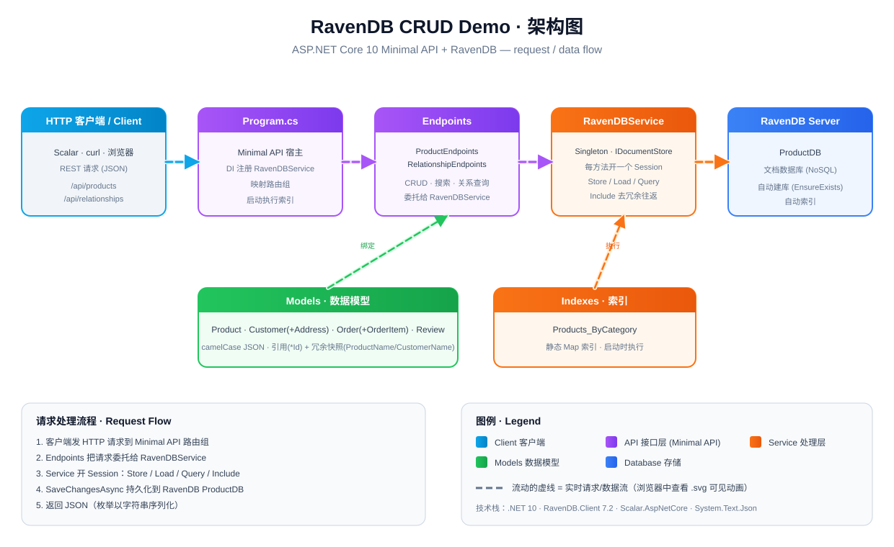

# RavenDB.CRUD.Demo

A minimal-API demo showing **CRUD and document-relationship patterns against RavenDB** (NoSQL document database).
Built with ASP.NET Core 10 minimal APIs, `RavenDB.Client`, and a Scalar-powered API reference UI.



> Open [`architecture.svg`](architecture.svg) in a browser to see the animated request/data flow (GitHub renders SVGs statically).

## Architecture

| Layer | Responsibility |
|---|---|
| **`Program.cs`** | Composition root — registers `RavenDBService` as a DI singleton, maps endpoint groups, executes the `Products_ByCategory` index at startup. |
| **`Endpoints/`** | Minimal-API route groups (`ProductEndpoints`, `RelationshipEndpoints`) as static extension methods. Thin handlers that delegate to the service. |
| **`Services/RavenDBService`** | Data-access core. Holds the singleton `IDocumentStore`; each method opens its **own** `IAsyncDocumentSession` (one unit-of-work per call). |
| **`Models/`** | POCOs (`Product`, `Customer`+`Address`, `Order`+`OrderItem`+`OrderStatus`, `Review`) with camelCase JSON mapping. |
| **`Indexes/`** | Static RavenDB Map index (`Products_ByCategory`). |

The store is a singleton; sessions are short-lived and per-request. Related documents are linked by `*Id` and denormalized (e.g. `OrderItem.ProductName`) for cheap reads, with `Include<>()` to avoid N+1 round-trips.

## Tech stack

- .NET 10 · ASP.NET Core Minimal API
- `RavenDB.Client` 7.2
- `Scalar.AspNetCore` (API reference UI)
- `System.Text.Json` (with `JsonStringEnumConverter`)

## Prerequisites

- .NET SDK **10.0.x**
- A reachable **RavenDB server**. By default the app connects to `http://localhost:8080` and database `ProductDB` (see `appsettings.json` → `RavenDB`). The database is **auto-created on startup** if it doesn't exist.

## Getting started

```bash
dotnet restore
dotnet build
dotnet run --project RavenDB.CRUD.Demo
```

The API listens on `http://localhost:5254` / `https://localhost:7163`. In Development, open the Scalar reference UI at `/scalar/v1`.

Load sample data (customers, products, orders, reviews):

```
POST /api/relationships/seed
```

## API overview

### Products — `/api/products`
| Method | Route | Notes |
|---|---|---|
| GET | `/api/products` | List all |
| GET | `/api/products/{*id}` | By id (e.g. `products/1-A`) |
| GET | `/api/products/category/{category}` | Filter by category |
| GET | `/api/products/search?q={term}` | Full-text search (`Name`/`Description`) |
| POST | `/api/products` | Create |
| PUT | `/api/products/{*id}` | Full-field update |
| DELETE | `/api/products/{*id}` | Delete |

### Relationships — `/api/relationships`
| Method | Route | Notes |
|---|---|---|
| POST | `/orders` | Create order (validates customer + products, computes totals) |
| GET | `/orders/{*id}` | Order with included customer & products |
| GET | `/customers/{customerId}/orders` | Orders for a customer |
| GET | `/products/{productId}/reviews` | Reviews for a product |
| POST | `/reviews` | Create review (auto-sets `verifiedPurchase`) |
| GET | `/customers/{customerId}/purchase-history` | Aggregated purchase history |

## Conventions worth knowing

- **Document IDs contain `/`** (e.g. `products/1-A`), so terminal id routes use a catch-all `{*id}` plus `Uri.UnescapeDataString(id)` — ASP.NET does not auto-decode `%2F` in route values. Clients (Scalar, curl) typically send the encoded form.
- **Full-text search** uses `.Search()`, not `string.Contains()` (RavenDB's LINQ provider rejects substring `Contains`).
- **Enums** (`OrderStatus`) serialize as strings via `JsonStringEnumConverter`.
- `PUT /api/products/{id}` is a **full replacement** of `name`/`description`/`price`/`category`/`inStock` — omitted fields reset to defaults.
